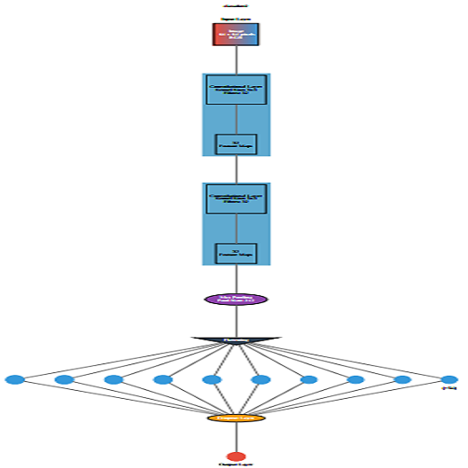
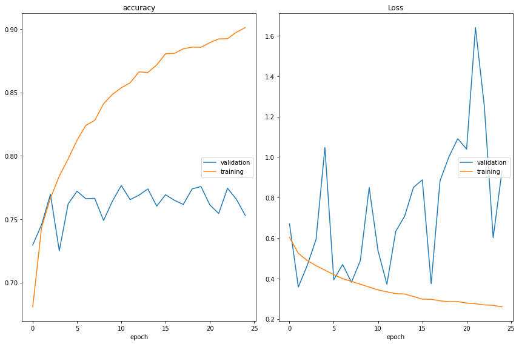

<!-- PROJECT SHIELDS -->
<!--
*** I'm using markdown "reference style" links for readability.
*** Reference links are enclosed in brackets [ ] instead of parentheses ( ).
*** See the bottom of this document for the declaration of the reference variables
*** for contributors-url, forks-url, etc. This is an optional, concise syntax you may use.
*** https://www.markdownguide.org/basic-syntax/#reference-style-links
-->
[ Contributors ][contributors-url]
[ Forks ][forks-url]
[ Stargazers ][stars-url]
[ Issues ][issues-url]
[ LinkedIn ][linkedin-url]


<!-- PROJECT LOGO -->
<br />
<p align="center">
  <a href="https://github.com/
           /Cat_Dog_Classifier">
    
  </a>

  <h3 align="center">Cat_Dog_Classifier</h3>

  <p align="center">
    The following project is a Cat-Dog classifier, implemented using CNN and deployed using tflite as an android application
    <br />
    <a href="https://github.com/guptahimachal/Cat_Dog_Classifier"><strong>Explore the docs »</strong></a>
    <br />
    <br />
    <a href="https://github.com/guptahimachal/Cat_Dog_Classifier">View Demo</a>
    ·
    <a href="https://github.com/guptahimachal/Cat_Dog_Classifier/issues">Report Bug</a>
    ·
    <a href="https://github.com/guptahimachal/Cat_Dog_Classifier/issues">Request Feature</a>
  </p>
</p>


<!-- TABLE OF CONTENTS -->
## Table of Contents

* [About the Project](#about-the-project)
* [Getting Started](#getting-started)
  * [Prerequisites](#prerequisites)
  * [Installation](#installation)
* [Usage](#usage)
* [Roadmap](#roadmap)
  * [MODEL_1](#MODEL_1)
* [Contributing](#contributing)
* [License](#license)
* [Contact](#contact)
* [Acknowledgements](#acknowledgements)


<!-- ABOUT THE PROJECT -->
## About The Project

[![Product Name Screen Shot][product-screenshot]](https://example.com)


**Image Classification - Cat or Dog using Convolution Neural Network:**
I have used Google Colab Notebook and implemented with keras


<!-- GETTING STARTED -->
## Getting Started
The datasets are taken from [Kaggle][Dataset]. It consist of 8000 training set and 2000 test set.
I have used the 2000 test images for validation
### Prerequisites

* tensorflow - '1.15.2'
* Keras - '2.2.4-tf'

### Installation


1. For selecting tensorflow in  Colab Notebook
```python
%tensorflow_version 1.x
import tensorflow as tf
```
2. Keras
```python
from tensorflow.keras.models import Sequential
from tensorflow.keras.layers import Convolution2D
from tensorflow.keras.layers import Conv2D
from tensorflow.keras.layers import MaxPool2D
from tensorflow.keras.layers import Flatten
from tensorflow.keras.layers import Dense
from tensorflow.keras.layers import Dropout
``` 


<!-- USAGE EXAMPLES -->
## Usage

Using this project we can extend it to classification of images to different other classes , For example it can be used in tagging images while storing if one has to store a lot
of images and search among them.

 **Directory Structure-**
```
dataset
  ├───test_set
  |   ├───cats
  |   |    └───cat.4001.jpg
  |   |        cat.4002.jpg
  |   |        ...
  |   |
  |   |
  |   └───dogs
  |        └───dog.4001.jpg
  |            dog.4002.jpg
  |            ...
  |
  └───training_set
      ├───cats
      |     └───cat.1.jpg
      |         cat.10.jpg
      |         ...
      |
      └───dogs
           └───dog.1.jpg
               dog.10.jpg
               ...
  ```

<!-- ROADMAP -->
## Roadmap

In the training set we have 4000 images/class and validation we have 1000 images per class
We have used ImageDataGenerator which provide a different configuration of image for each epoch which differ by different properties like zoom, horizontal/vertical shift, flip, rotation etc.

We start by using a simple model architecture - 

<!-- MODEL_1 -->
## MODEL_1

```
Model: "sequential_1"
_________________________________________________________________
Layer (type)                 Output Shape              Param #   
=================================================================
conv2d_1 (Conv2D)            (None, 62, 62, 32)        896       
_________________________________________________________________
max_pooling2d_1 (MaxPooling2 (None, 31, 31, 32)        0         
_________________________________________________________________
flatten_1 (Flatten)          (None, 30752)             0         
_________________________________________________________________
dense_1 (Dense)              (None, 128)               3936384   
_________________________________________________________________
dropout_1 (Dropout)          (None, 128)               0         
_________________________________________________________________
dense_2 (Dense)              (None, 1)                 129       
=================================================================
Total params: 3,937,409
Trainable params: 3,937,409
Non-trainable params: 0
_________________________________________________________________
```



<!-- CONTRIBUTING -->
## Contributing

Contributions are what make the open source community such an amazing place to be learn, inspire, and create. Any contributions you make are **greatly appreciated**.

1. Fork the Project
2. Create your Feature Branch (`git checkout -b feature/AmazingFeature`)
3. Commit your Changes (`git commit -m 'Add some AmazingFeature'`)
4. Push to the Branch (`git push origin feature/AmazingFeature`)
5. Open a Pull Request


<!-- LICENSE -->
## License

Distributed under the MIT License. See `LICENSE` for more information.


<!-- CONTACT -->
## Contact

Your Name - [@twitter_handle](https://twitter.com/twitter_handle) - email

Project Link: [https://github.com/guptahimachal/Cat_Dog_Classifier](https://github.com/guptahimachal/Cat_Dog_Classifier)


<!-- ACKNOWLEDGEMENTS -->
## Acknowledgements

* []()
* []()
* []()


<!-- MARKDOWN LINKS & IMAGES -->
<!-- https://www.markdownguide.org/basic-syntax/#reference-style-links -->
[contributors-url]: https://github.com/guptahimachal/Cat_Dog_Classifier/graphs/contributors
[forks-url]: https://github.com/guptahimachal/Cat_Dog_Classifier/network/members
[stars-url]: https://github.com/guptahimachal/Cat_Dog_Classifier/stargazers
[issues-url]: https://github.com/guptahimachal/Cat_Dog_Classifier/issues
[license-url]: https://github.com/guptahimachal/Cat_Dog_Classifier/blob/master/LICENSE.txt
[linkedin-url]: https://linkedin.com/in/guptahimachal
[product-screenshot]: images/screenshot.png
[Dataset]: https://www.kaggle.com/chetankv/dogs-cats-images
