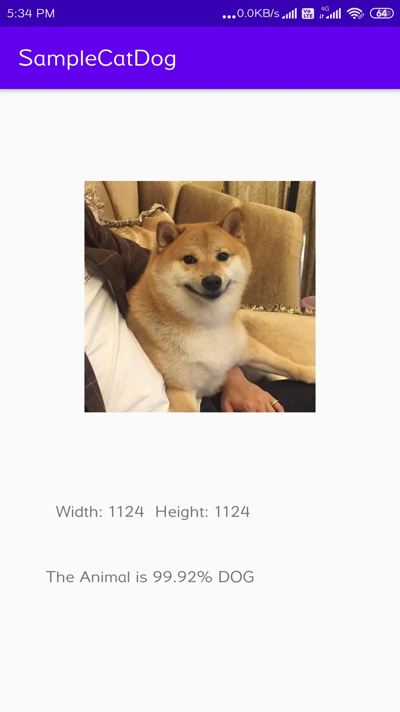

[ Contributors ][contributors-url]
[ Forks ][forks-url]
[ Stargazers ][stars-url]
[ Issues ][issues-url]
[ LinkedIn ][linkedin-url]


<!-- PROJECT LOGO -->
<br />
<p align="center">
  <a href="https://github.com/
           /Cat_Dog_Classifier">
    
  </a>

  <h3 align="center">Cat_Dog_Classifier</h3>

  <p align="center">
    The following project is a Cat-Dog classifier, implemented using CNN and deployed using tflite as an android application
    <br />
    <a href="https://github.com/guptahimachal/Cat_Dog_Classifier"><strong>Explore the docs »</strong></a>
    <br />
    <br />
    <a href="https://github.com/guptahimachal/Cat_Dog_Classifier">View Demo</a>
    ·
    <a href="https://github.com/guptahimachal/Cat_Dog_Classifier/issues">Report Bug</a>
    ·
    <a href="https://github.com/guptahimachal/Cat_Dog_Classifier/issues">Request Feature</a>
  </p>
</p>


<!-- TABLE OF CONTENTS -->
## Table of Contents

* [About the Project](#about-the-project)
  * [Use Cases](#use-cases)
* [Getting Started](#getting-started)
  * [Prerequisites](#prerequisites)
  * [Installation](#installation)
* [Usage](#usage)
* [Roadmap](#roadmap)
  * [MODEL_1](#MODEL_1)
  * [MODEL_2](#MODEL_2)
  * [MODEL_3](#MODEL_3)
  * [MODEL_4](#MODEL_4)
* [Deployment](#demloyment)


<!-- ABOUT THE PROJECT -->
## About The Project


**Image Classification - Cat or Dog using Convolution Neural Network:**
I have used Google Colab Notebook and implemented with keras

### Use Cases

<p float="left">
 

</p>
<p float="left">


</p>
<p float="left">


</p>

<!-- GETTING STARTED -->
## Getting Started
The datasets are taken from [Kaggle][Dataset]. It consist of 8000 training set and 2000 test set.
I have used the 2000 test images for validation
### Prerequisites

* tensorflow - '1.15.2'
* Keras - '2.2.4-tf'

### Installation


1. For selecting tensorflow in  Colab Notebook
```python
%tensorflow_version 1.x
import tensorflow as tf
```
2. Keras
```python
from tensorflow.keras.models import Sequential
from tensorflow.keras.layers import Convolution2D
from tensorflow.keras.layers import Conv2D
from tensorflow.keras.layers import MaxPool2D
from tensorflow.keras.layers import Flatten
from tensorflow.keras.layers import Dense
from tensorflow.keras.layers import Dropout
``` 


<!-- USAGE EXAMPLES -->
## Usage

Using this project we can extend it to classification of images to different other classes , For example it can be used in tagging images while storing if one has to store a lot
of images and search among them.

 **Directory Structure-**
```
dataset
  ├───test_set
  |   ├───cats
  |   |    └───cat.4001.jpg
  |   |        cat.4002.jpg
  |   |        ...
  |   |
  |   |
  |   └───dogs
  |        └───dog.4001.jpg
  |            dog.4002.jpg
  |            ...
  |
  └───training_set
      ├───cats
      |     └───cat.1.jpg
      |         cat.10.jpg
      |         ...
      |
      └───dogs
           └───dog.1.jpg
               dog.10.jpg
               ...
  ```

<!-- ROADMAP -->
## Roadmap

In the training set we have 4000 images/class and validation we have 1000 images per class
We have used ImageDataGenerator which provide a different configuration of image for each epoch which differ by different properties like zoom, horizontal/vertical shift, flip, rotation etc.

We start by using a simple model architecture - 

<!-- MODEL_1 -->
### MODEL_1

```
Model: "sequential_1"
_________________________________________________________________
Layer (type)                 Output Shape              Param #   
=================================================================
conv2d_1 (Conv2D)            (None, 62, 62, 32)        896       
_________________________________________________________________
max_pooling2d_1 (MaxPooling2 (None, 31, 31, 32)        0         
_________________________________________________________________
flatten_1 (Flatten)          (None, 30752)             0         
_________________________________________________________________
dense_1 (Dense)              (None, 128)               3936384   
_________________________________________________________________
dropout_1 (Dropout)          (None, 128)               0         
_________________________________________________________________
dense_2 (Dense)              (None, 1)                 129       
=================================================================
Total params: 3,937,409
Trainable params: 3,937,409
Non-trainable params: 0
_________________________________________________________________
```


### MODEL_2
```
Model: "sequential_2"
_________________________________________________________________
Layer (type)                 Output Shape              Param #   
=================================================================
conv2d_3 (Conv2D)            (None, 62, 62, 32)        896       
_________________________________________________________________
max_pooling2d_2 (MaxPooling2 (None, 31, 31, 32)        0         
_________________________________________________________________
conv2d_4 (Conv2D)            (None, 29, 29, 32)        9248      
_________________________________________________________________
max_pooling2d_3 (MaxPooling2 (None, 14, 14, 32)        0         
_________________________________________________________________
flatten_2 (Flatten)          (None, 6272)              0         
_________________________________________________________________
dense_3 (Dense)              (None, 128)               802944    
_________________________________________________________________
dropout_2 (Dropout)          (None, 128)               0         
_________________________________________________________________
dense_4 (Dense)              (None, 64)                8256      
_________________________________________________________________
dropout_3 (Dropout)          (None, 64)                0         
_________________________________________________________________
dense_5 (Dense)              (None, 1)                 65        
=================================================================
Total params: 821,409
Trainable params: 821,409
Non-trainable params: 0
_________________________________________________________________

```


### MODEL_3

Here I have decrease the learning rate of RMSProp Opimizer to 0.0001

```

Model: "sequential_3"
_________________________________________________________________
Layer (type)                 Output Shape              Param #   
=================================================================
conv2d_10 (Conv2D)           (None, 62, 62, 64)        1792      
_________________________________________________________________
conv2d_11 (Conv2D)           (None, 60, 60, 128)       73856     
_________________________________________________________________
conv2d_12 (Conv2D)           (None, 58, 58, 256)       295168    
_________________________________________________________________
max_pooling2d_6 (MaxPooling2 (None, 29, 29, 256)       0         
_________________________________________________________________
conv2d_13 (Conv2D)           (None, 27, 27, 256)       590080    
_________________________________________________________________
max_pooling2d_7 (MaxPooling2 (None, 13, 13, 256)       0         
_________________________________________________________________
conv2d_14 (Conv2D)           (None, 11, 11, 512)       1180160   
_________________________________________________________________
max_pooling2d_8 (MaxPooling2 (None, 5, 5, 512)         0         
_________________________________________________________________
flatten_3 (Flatten)          (None, 12800)             0         
_________________________________________________________________
dense_5 (Dense)              (None, 256)               3277056   
_________________________________________________________________
dropout_3 (Dropout)          (None, 256)               0         
_________________________________________________________________
dense_6 (Dense)              (None, 1)                 257       
=================================================================
Total params: 5,418,369
Trainable params: 5,418,369
Non-trainable params: 0
```


### MODEL 4

Here along with the previous optimizer , changed the input image size from 64x64 to 128x128

```

_________________________________________________________________
Layer (type)                 Output Shape              Param #   
=================================================================
conv2d (Conv2D)              (None, 126, 126, 64)      1792      
_________________________________________________________________
conv2d_1 (Conv2D)            (None, 124, 124, 128)     73856     
_________________________________________________________________
conv2d_2 (Conv2D)            (None, 122, 122, 256)     295168    
_________________________________________________________________
max_pooling2d (MaxPooling2D) (None, 61, 61, 256)       0         
_________________________________________________________________
conv2d_3 (Conv2D)            (None, 59, 59, 256)       590080    
_________________________________________________________________
max_pooling2d_1 (MaxPooling2 (None, 29, 29, 256)       0         
_________________________________________________________________
conv2d_4 (Conv2D)            (None, 27, 27, 512)       1180160   
_________________________________________________________________
max_pooling2d_2 (MaxPooling2 (None, 13, 13, 512)       0         
_________________________________________________________________
flatten (Flatten)            (None, 86528)             0         
_________________________________________________________________
dense (Dense)                (None, 256)               22151424  
_________________________________________________________________
dropout (Dropout)            (None, 256)               0         
_________________________________________________________________
dense_1 (Dense)              (None, 1)                 257       
=================================================================
Total params: 24,292,737
Trainable params: 24,292,737
Non-trainable params: 0
_________________________________________________________________
```


## Deployment - using Tensorflow Lite


For the deployment of the model , I have saved the model and converted it to tflite format and made a simple android application which takes an input image, and transform it into model's input shape (3x128x128 or 3x64x64) and pass it to the model dispalying the percentage of result.


```python
model.save('model.h5')
converter = tf.lite.TFLiteConverter.from_keras_model_file( '/content/model.h5' ) # Your model's name
modeltf = converter.convert()
file = open( 'model.tflite' , 'wb' ) 
file.write(modeltf)
```


<!-- MARKDOWN LINKS & IMAGES -->
[contributors-url]: https://github.com/guptahimachal/Cat_Dog_Classifier/graphs/contributors
[forks-url]: https://github.com/guptahimachal/Cat_Dog_Classifier/network/members
[stars-url]: https://github.com/guptahimachal/Cat_Dog_Classifier/stargazers
[issues-url]: https://github.com/guptahimachal/Cat_Dog_Classifier/issues
[license-url]: https://github.com/guptahimachal/Cat_Dog_Classifier/blob/master/LICENSE.txt
[linkedin-url]: https://linkedin.com/in/guptahimachal
[product-screenshot]: images/screenshot.png
[Dataset]: https://www.kaggle.com/chetankv/dogs-cats-images
